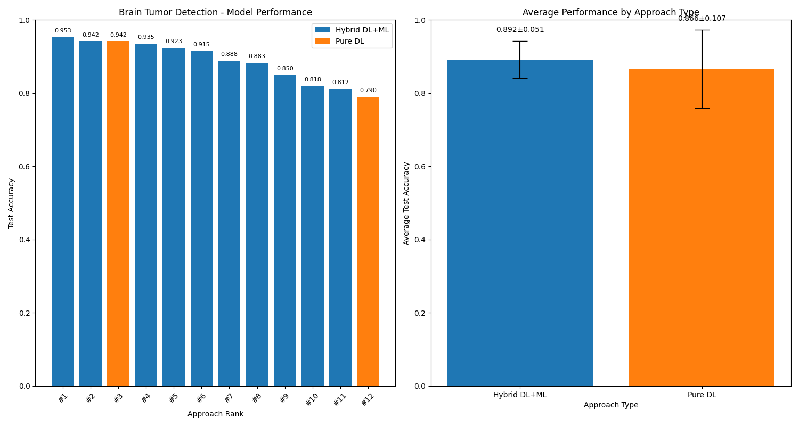
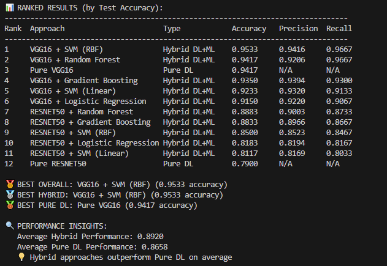

# Brain Tumor Detection: Hybrid DL+ML Comparative Study

A comparative analysis of pure deep learning vs hybrid deep learning + machine learning approaches for brain tumor detection in MRI imaging. Evaluated 12 model configurations to find the optimal architecture balancing accuracy and interpretability.

---

## Results

---

## Key Findings

**Best model:** VGG16 + SVM (RBF) with **95.33% accuracy**, 0.9416 precision, and 0.9667 recall

| Approach Type | Average Accuracy |
|---|---|
| Hybrid DL+ML | 89.20% ± 5.1% |
| Pure Deep Learning | 86.58% ± 10.7% |

Hybrid approaches outperformed pure deep learning by **2.62 percentage points** on average.

---

## All 12 Configurations Ranked

| Rank | Model | Type | Accuracy | Precision | Recall |
|---|---|---|---|---|---|
| 1 | VGG16 + SVM (RBF) | Hybrid | 0.9533 | 0.9416 | 0.9667 |
| 2 | VGG16 + Random Forest | Hybrid | 0.9417 | 0.9206 | 0.9667 |
| 3 | Pure VGG16 | Pure DL | 0.9417 | N/A | N/A |
| 4 | VGG16 + Gradient Boosting | Hybrid | 0.9350 | 0.9394 | 0.9300 |
| 5 | VGG16 + SVM (Linear) | Hybrid | 0.9233 | 0.9320 | 0.9133 |
| 6 | VGG16 + Logistic Regression | Hybrid | 0.9150 | 0.9220 | 0.9067 |
| 7 | ResNet50 + Random Forest | Hybrid | 0.8883 | 0.9003 | 0.8733 |
| 8 | ResNet50 + Gradient Boosting | Hybrid | 0.8833 | 0.8966 | 0.8667 |
| 9 | ResNet50 + SVM (RBF) | Hybrid | 0.8500 | 0.8523 | 0.8467 |
| 10 | ResNet50 + Logistic Regression | Hybrid | 0.8183 | 0.8194 | 0.8167 |
| 11 | ResNet50 + SVM (Linear) | Hybrid | 0.8117 | 0.8169 | 0.8033 |
| 12 | Pure ResNet50 | Pure DL | 0.7900 | N/A | N/A |

---

## Approach

**Stage 1: Feature Extraction**

Pre-trained VGG16 or ResNet50 models process brain MRI images with the final classification layers removed, producing high-dimensional feature vectors (VGG16: 4096 features, ResNet50: 2048 features).

**Stage 2: ML Classification**

The extracted feature vectors are passed into traditional ML classifiers: SVM (RBF and Linear kernels), Random Forest, Gradient Boosting, and Logistic Regression.

**Why hybrid?**

Pure deep learning models treat classification as a black box. In medical imaging, clinicians need to understand why a model made a decision for regulatory and liability reasons. ML classifiers provide feature importance rankings, decision boundaries, and confidence scores that map back to the original image regions.

---

## Why VGG16 Outperformed ResNet50

VGG16-based configurations occupied all 6 top positions. The simpler, more uniform architecture of VGG16 appears to produce feature representations that are more separable by traditional ML classifiers compared to ResNet50's skip connection-based features.

---

